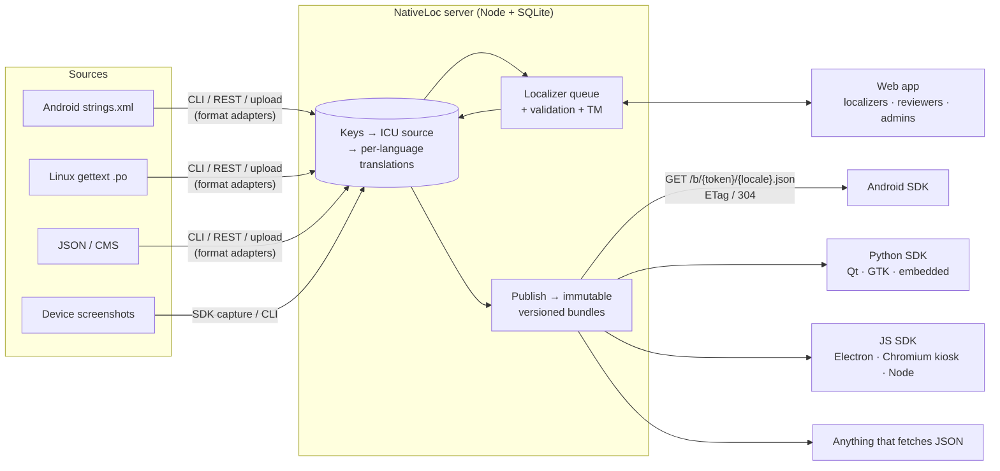

# NativeLoc

Get your product text translated by **native speakers** and delivered to **Android and Linux
screen devices** (kiosks, panels, tablets, signage), without spreadsheets, file juggling, or
asking translators to learn format syntax.

- **Developers** push strings from their repos (`strings.xml`, gettext `.po`, JSON) with a CLI,
  the REST API, or a web upload. Devices can send screenshots, so every string has visual context.
- **Localizers** get one string at a time: the original, a screenshot with the string highlighted,
  a note, a length meter, placeholder chips, plural forms for their language, and suggestions
  from translation memory. The whole flow works from the keyboard.
- **Devices** pull one small JSON file per language from a cache-friendly URL and keep working
  offline.

## How it fits together



**One model:** every string from any format becomes a *key* with an **ICU MessageFormat** source
message. Platform formats exist only at the edges, as adapters (`packages/core/src/adapters`).
Android `%1$s` becomes `{arg1}`, Android `<plurals>` and gettext `msgid_plural` become ICU plurals,
and the reverse happens on export. Devices only ever see:

```
GET /b/{bundleToken}/manifest.json   → { version, sourceLocale, locales: { es: { sha256, url, completeness } } }
GET /b/{bundleToken}/es.json         → { "checkout": "Pagar", "cart_items": "{arg1, plural, one {…} other {…}}" }
```

Untranslated keys fall back to the source text inside each bundle, so a device that downloads
one file always has every string.

## Quick start

Requires Node 22.5+ (it uses the built-in `node:sqlite`).

```bash
npm install
npm run seed      # demo org, users, 3 projects (Android kiosk, Linux scale, web signage)
npm run dev       # API on :4600, web app on :5173
```

Open http://localhost:5173. The demo accounts and the demo CLI token are listed at the top of
[apps/server/src/seed.ts](apps/server/src/seed.ts). Sign in as the Spanish localizer to see the
translator experience, or as the admin to manage projects.

**See it on a "device":** `npm run dev -w @nativeloc/example-web-kiosk` opens a simulated
self-checkout screen on :5174. It renders through the JS SDK, picks up new versions within 15s
of publishing, and its **Capture & upload** button sends its own screen with exact text
positions, so localizers see each string highlighted in context.

Production: `docker compose up --build` (one container; data in a volume), or
`npm start` (builds the web app and serves it from the API server on :4600).

## The localizer experience

Everything in `apps/web/src/localizer/` aims to remove detail that isn't translation:

| Concern | How it's handled |
|---|---|
| Where is this text? | Device screenshot with the string highlighted; the rest of the screen is dimmed |
| What does it mean? | Context note from developers (taken from code comments automatically) |
| Placeholders | Shown as named chips ("name", "number"); `Alt+1…9` inserts; save is blocked if one is missing or misspelled |
| Plurals | Only the forms *their* language needs (Russian gets one/few/many), each labelled with example numbers. No ICU syntax |
| Fits on screen? | Live character meter from `max=N` hints in comments |
| Seen this before? | Translation-memory suggestions from approved strings; `Alt+Enter` applies the best one |
| Unsure? | `Ctrl+Shift+Enter` asks the team; the answer can be folded into the note for every language |
| Keys, files, formats | Hidden behind "Technical details" |

Keyboard: `Ctrl+Enter` save & next · `Ctrl+↓` skip · `Ctrl+↑` back · `Tab` next plural form.
Reviewers use the same screen with Approve / Save & approve / Send back.

Source changes mark translations **needs update** and show the old wording. Until someone
re-translates them, they keep shipping if they're still structurally valid.

## Getting strings in

**CLI** (`packages/cli`). Add a `nativeloc.config.json` to your repo
(see [examples/android](examples/android/nativeloc.config.json)):

```bash
export NATIVELOC_TOKEN=nl_…              # project → Devices & API → create "push" token
npx nativeloc push                        # upload source strings (comments → notes, max=N → limits)
npx nativeloc push --with-translations    # also import existing values-xx / xx.po
npx nativeloc screenshot shot.png --label "Cart" --keys cart_total,checkout
npx nativeloc publish
npx nativeloc pull                        # write approved translations into values-xx/ for offline builds
```

**REST.** `POST /api/v1/projects/:id/keys` with `Authorization: Bearer <push token>`:

```json
{ "entries": [{ "key": "checkout", "source": "Checkout", "description": "Cart button", "maxLength": 14 }] }
```

Add `"locale": "es"` to import existing translations; add `"prune": true` to archive keys
that are no longer sent.

**Web upload.** Project → *Import & export*.

**Screenshots.** Use the SDK capture helpers (exact boxes), the CLI, or upload and draw boxes in
*Screenshots*.

## Device SDKs

All three share one surface: `init` → `t(key, args)` → automatic refresh. Lookup order is
downloaded bundle → bundled/app fallback → source language → key, and `t` never throws.

| SDK | Path | Notes |
|---|---|---|
| JS / TS | [sdks/js](sdks/js) | `intl-messageformat`; `localStorage` or `fileStorage(dir)` cache; `captureContext()` |
| Python | [sdks/python/nativeloc.py](sdks/python/nativeloc.py) | One file, stdlib only, built-in ICU formatter and CLDR plural rules for common languages |
| Android | [sdks/android](sdks/android) | Kotlin, minSdk 24 (`android.icu.MessageFormat`); falls back to the app's own `res/values*`; `NativeLocCapture` for debug builds |

```kotlin
NativeLoc.init(context, "https://loc.example.com", "pb_…", locale = "es")
cartView.text = NativeLoc.t("cart_items", 3)
```

```python
loc = NativeLoc("https://loc.example.com", "pb_…", locale="es", cache_dir="/var/cache/app/loc")
label.set_text(loc.t("%d label printed", arg1=3))
```

## Project layout

```
packages/core     ICU validation, plural rules, editor model, format adapters (shared by everything)
packages/cli      nativeloc CLI
apps/server       Fastify + node:sqlite API, auth, queue, publish, device endpoints
apps/web          React app: localizer workspace + admin
sdks/{js,python,android}
examples/         sample strings.xml / .pot / JSON, web kiosk simulator, Linux demo
```

## Development

```bash
npm test          # core adapters, validation, server end-to-end, JS SDK
npm run typecheck
python -m unittest sdks/python/test_nativeloc.py
```

Roles: **admin** (everything), **reviewer** (translate + approve, assigned languages),
**localizer** (translate assigned languages). Admins invite people with a link; invitees
choose a password and land in their queue.

### Not in this MVP

Machine-translation suggestions (the queue's suggestion list is the place to add a provider),
Postgres (the SQL is plain; `apps/server/src/db.ts` is the only storage module), SSO, webhooks
on publish, and iOS/Qt `.ts`/XLIFF adapters.
